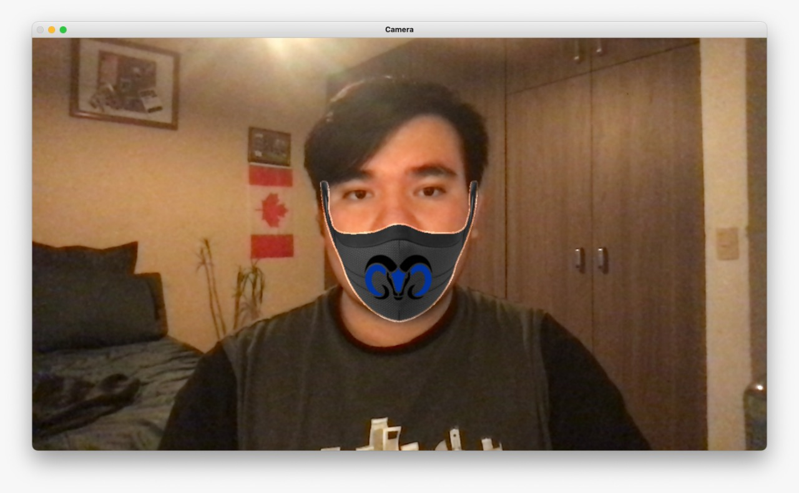

# Pytagram

---

Este es el repositorio de nuestro proyecto Pytagram. El proyecto consiste en un script de python que emula los filtros de instagram que detectan la ubicación y posición de tu cara y sobrepone una imagen sobre ella, en nuestro caso la imagen es un cubrebocas del Tec.

## Requisitos 

Para correr este script se requiere Python 3 e instalar las dependencias que se encuentran en **requirements.txt**

## Instalación

Para instalar las dependencias utilizando el instalador de paquetes pip, corremos el siguiente codigo en la terminal:

```shell
pip3 install -r requirements.txt
``` 

## Uso

Para correr este script asegurarse de estar en el directorio del proyecto y ejecutar el siguiente codigo en la terminal:

```shell
python3 Pytagram.py
```

Para terminar la ejecución del script hacer click en el video y presionar la tecla ESC

## Ejemplo



---

### Referencias

- [🤴 Creando Filtros como los de Instagram | OpenCV Python](https://github.com/GabySol/OmesTutorials2020/tree/master/19%20FILTRO_gorro_tiara_2021)
 